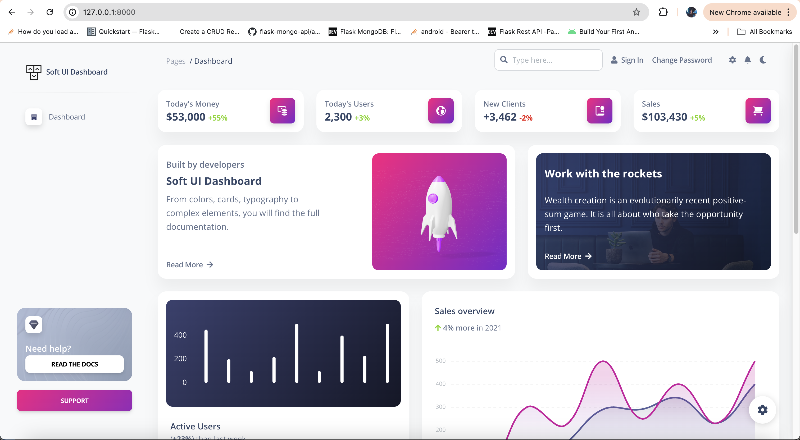

# **Lab 2: Task 2 – Setup that starter kit and make it run on your local server**
> **Deliverable** - Please provide screenshot of the starter kit running on your localhost.

- ✅ Screenshot: (image below 👇)
 
