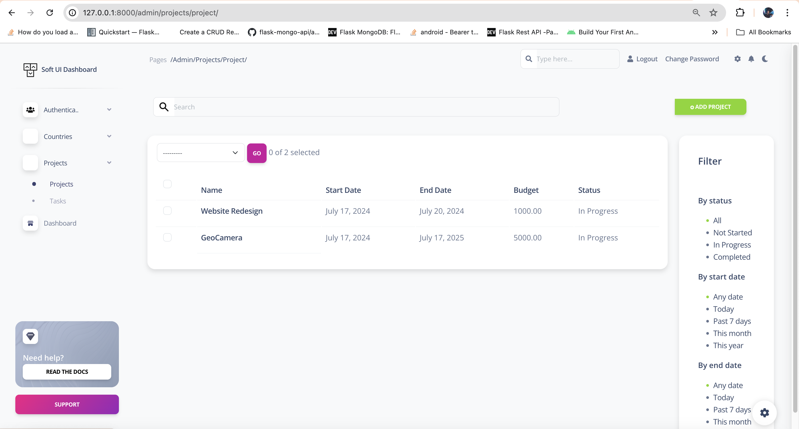
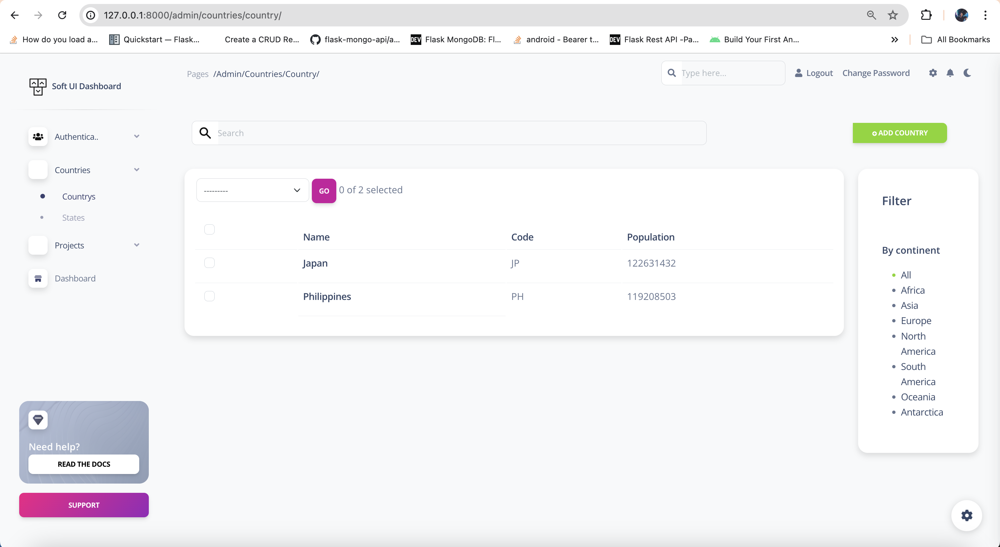
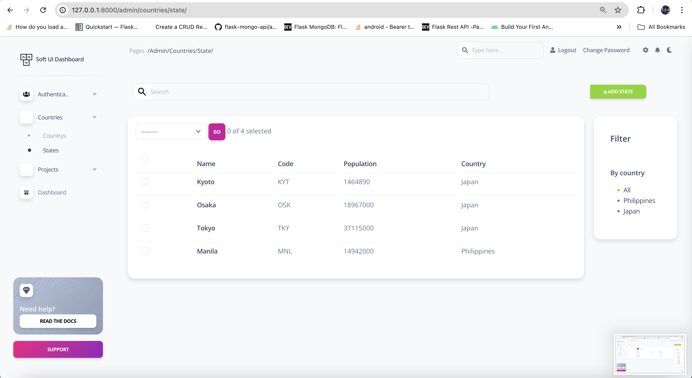

# **Lab 2: Task 4 - Setup Django admin for Task 3 and the ability to add foreign key models from the parent model**

> **Deliverable** -  Please provide a screenshot of the field implemented in your localhost and provide link to a GITHUB repository. Please be
sure to include Lab2-Task4.md file in your /submission-lab2 folder.

- ✅ Github Repository: [BuzzerBoy Lab2 - Task 4](https://github.com/alibacelonia/buzzerboy-lab2)
- ✅ Screenshots: (image below 👇)
 

 

 

 
