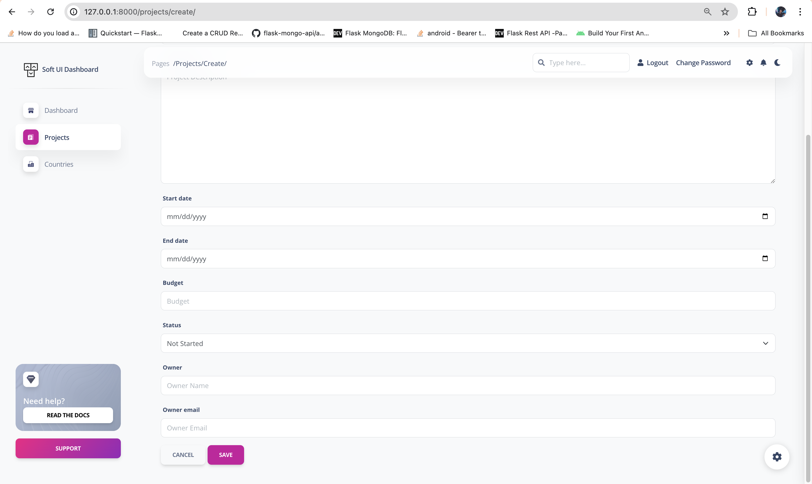
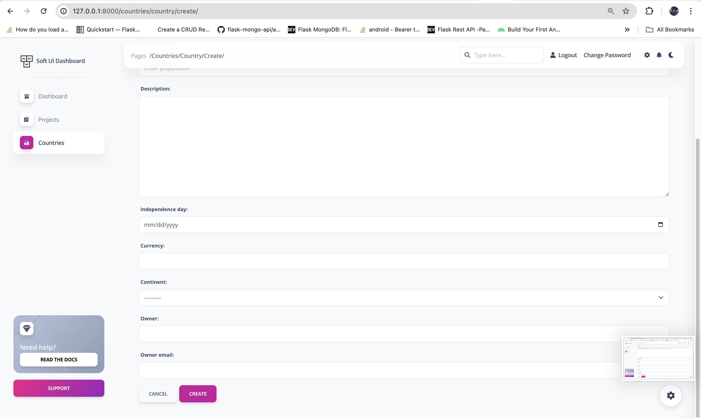
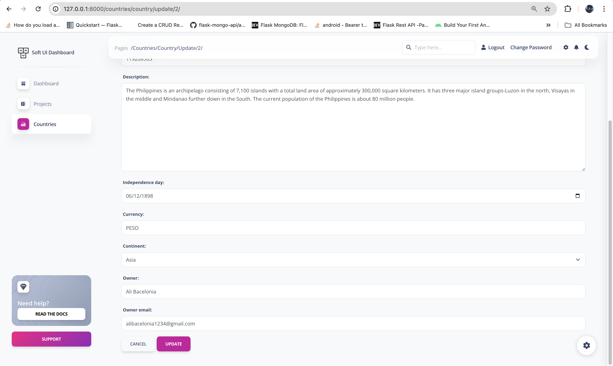

# **Lab 2: Task 5 - Add an Owner field, and Owner Email Address in your Task 3, and make sure there is an email address field**

> **Deliverable** -  Please provide a screenshot of the field implemented in your localhost and provide link to a GITHUB repository. Please be sure to include Lab2-Task5.md file in your /submission-lab2 directory to show screenshots of implemented functionality.

- ✅ Github Repository: [BuzzerBoy Lab2 - Task 5](https://github.com/alibacelonia/buzzerboy-lab2)
- ✅ Screenshot: (image below 👇)
 

 

 

 
