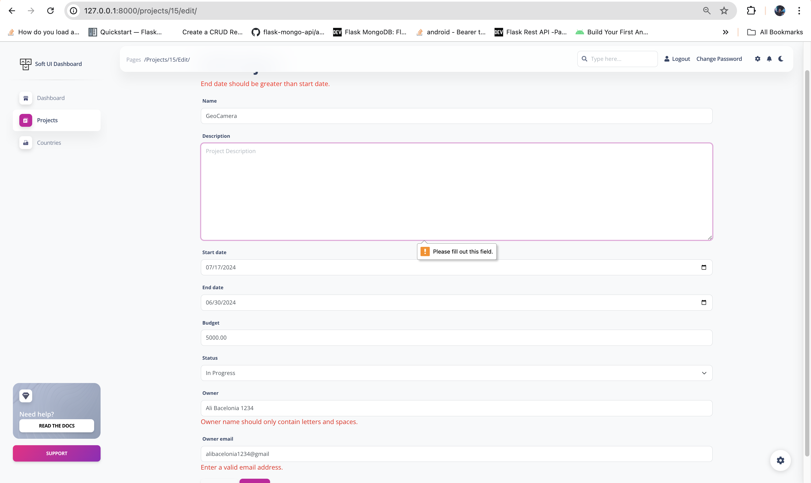
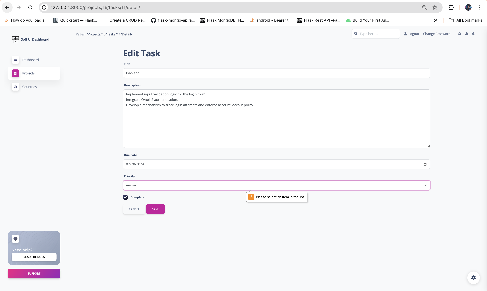
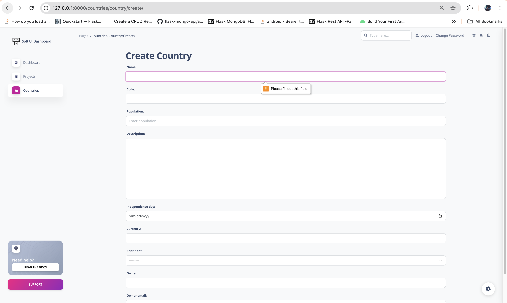
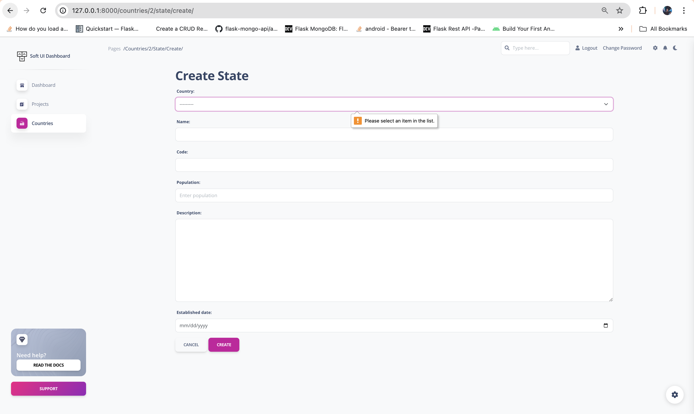

# **Lab 2: Task 6 - Create validations for fields of your choosing in Task 3. There should be validations should be for email, non-empty, and numeric.**

> **Deliverable** -  Please provide a screenshot of the field implemented in your localhost and provide link to a GITHUB repository. Please be sure to include Lab2-Task6.md file in your /submission-lab2 directory to show screenshots of implemented functionality

- ✅ Github Repository: [BuzzerBoy Lab2 - Task 6](https://github.com/alibacelonia/buzzerboy-lab2)
- ✅ Screenshot: (image below 👇)
 

 

 

 
